# Pruebas del Sistema OptiVida

## M1 - Presupuesto Mensual (LP)

### Prueba 1 - Caso normal
**Entrada:**
- Ingreso: Bs 3000
- Alimentacion: 35%, Transporte: 10%, Estudios: 20%,
  Salud/Bienestar: 15%, Ocio: 10%, Ahorro: 10%

**Resultado esperado:** Solucion optima con montos dentro de los rangos permitidos

**Resultado obtenido:** Optimo ✅
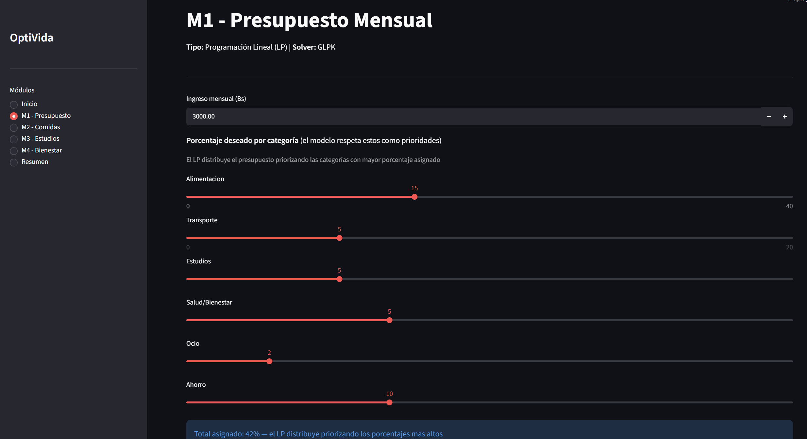
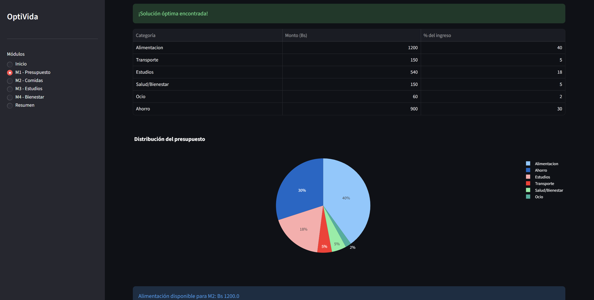

### Prueba 2 - Ingreso cero
**Entrada:** Ingreso: Bs 0

**Resultado esperado:** Error "El ingreso debe ser mayor a 0"

**Resultado obtenido:** Error mostrado correctamente ✅
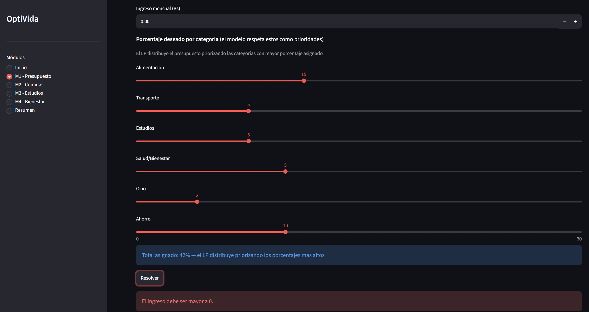

### Prueba 3 - Porcentajes en cero
**Entrada:** Todos los porcentajes en 0

**Resultado esperado:** Error "Asigna al menos un porcentaje mayor a 0"

**Resultado obtenido:** Error mostrado correctamente ✅
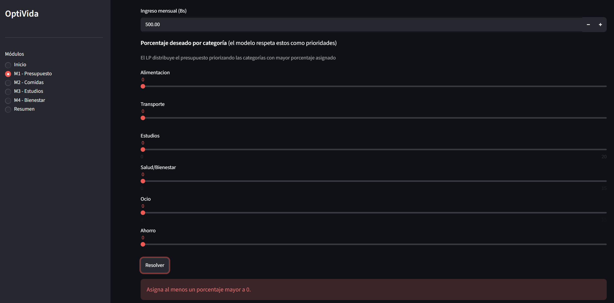

---

## M2 - Planificacion de Comidas (LP)

### Prueba 1 - Caso normal
**Entrada:**
- Presupuesto del M1: Bs 1200
- Calorias: 1800-2000, Proteina: 56g, Carbs: 225-290g
  Grasas: 50-77g, Fibra: 25-35g

**Resultado esperado:** Plan semanal con alimentos dentro del presupuesto
**Resultado obtenido:** Optimo ✅
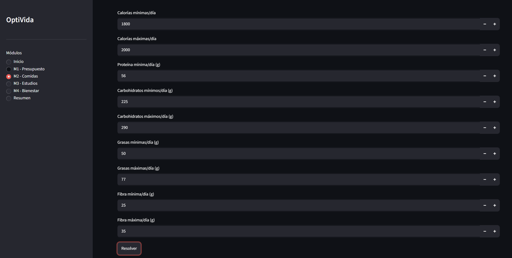
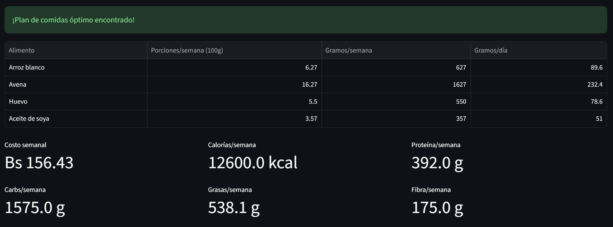

### Prueba 2 - Calorias minimas mayores que maximas
**Entrada:** Calorias min: 2500, Calorias max: 1800

**Resultado esperado:** Error de validacion

**Resultado obtenido:** Error mostrado correctamente ✅
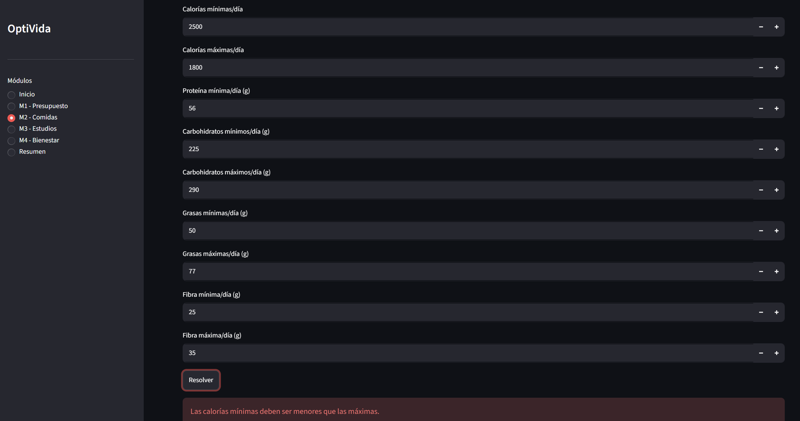

### Prueba 3 - Sin resolver M1 primero
**Entrada:** Ir directo a M2 sin resolver M1

**Resultado esperado:** Advertencia "Primero debes resolver el M1"

**Resultado obtenido:** Advertencia mostrada correctamente ✅
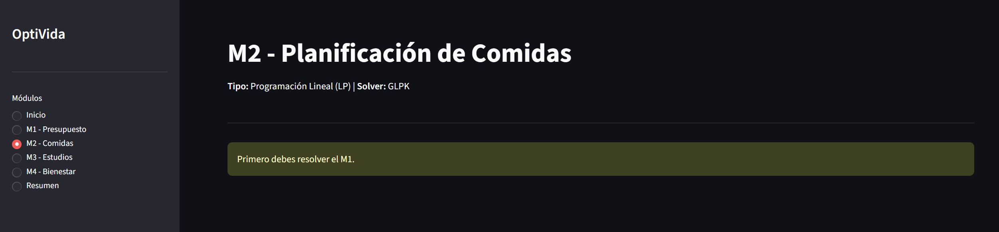

---

## M3 - Calendario de Estudios (MILP)

### Prueba 1 - Caso normal
**Entrada:**
- 6 materias, prioridades variadas
- Sin bloques bloqueados
- Maximo 3 bloques por dia

**Resultado esperado:** Calendario con minimo 6 horas por materia

**Resultado obtenido:** Optimo ✅
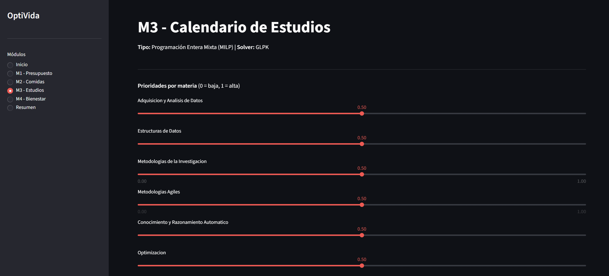
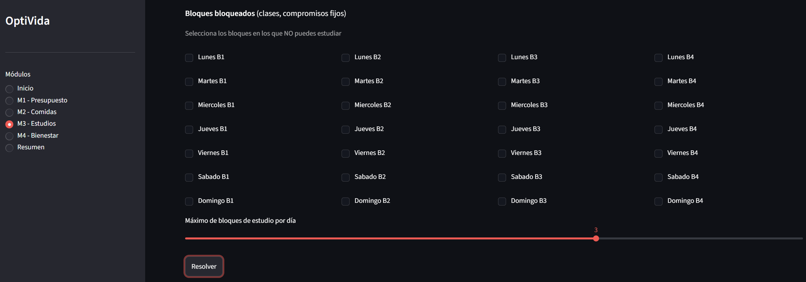
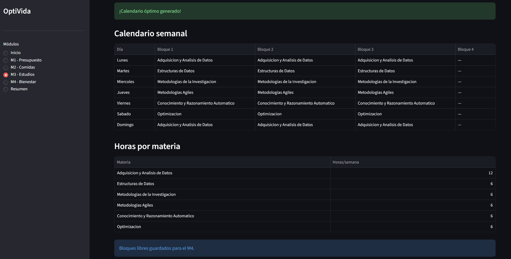

### Prueba 2 - Todos los bloques bloqueados
**Entrada:** Todos los checkboxes marcados

**Resultado esperado:** Error "No puedes bloquear todos los bloques"

**Resultado obtenido:** Error mostrado correctamente ✅
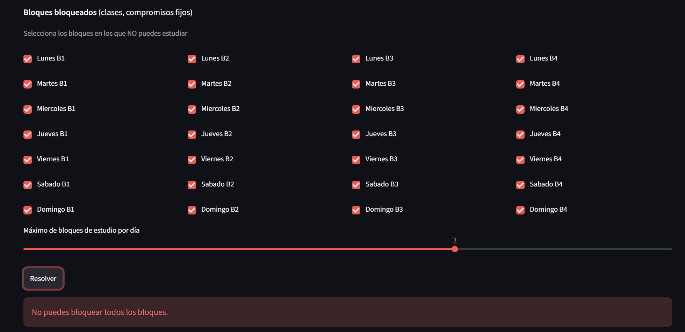

### Prueba 3 - Maximo 1 bloque por dia
**Entrada:** max_bloques_dia = 1

**Resultado esperado:** Calendario con maximo 1 bloque por dia

**Resultado obtenido:** Optimo ✅
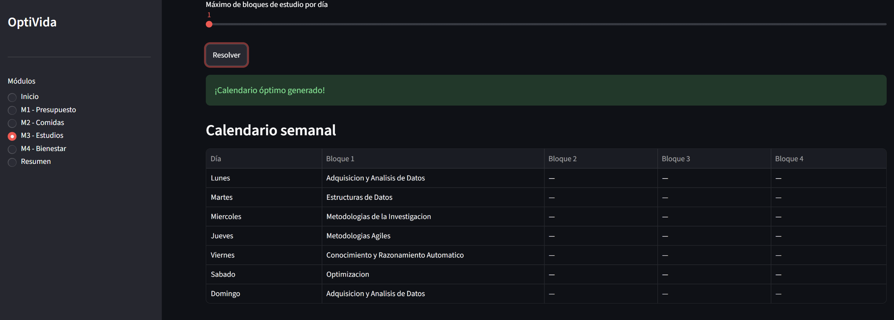
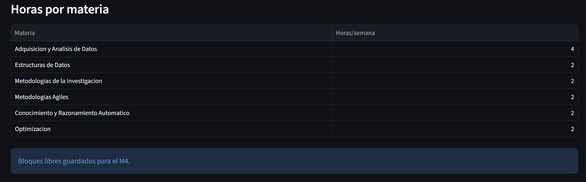

---

## M4 - Bienestar Estudiantil (NLP)

### Prueba 1 - Caso normal
**Entrada:**
- Presupuesto bienestar del M1: Bs 450
- Horas libres del M3: 14 horas
- Todos los items con importancia 0.5

**Resultado esperado:** Distribucion optima de gasto con utilidad maxima
**Resultado obtenido:** Optimo ✅
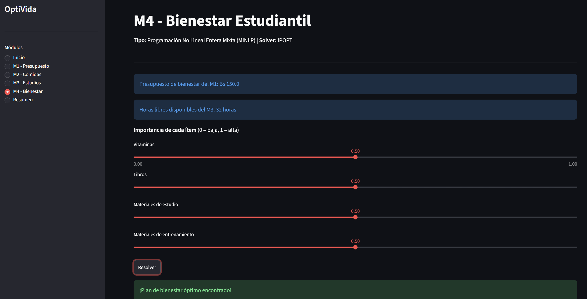
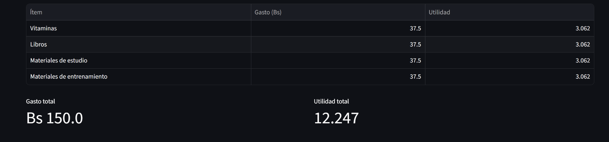

### Prueba 2 - Sin resolver M1
**Entrada:** Ir directo a M4 sin resolver M1

**Resultado esperado:** Advertencia "Primero debes resolver el M1"

**Resultado obtenido:** Advertencia mostrada correctamente ✅
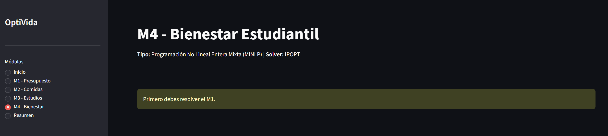

### Prueba 3 - Sin resolver M3
**Entrada:** Resolver M1 pero no M3, ir a M4

**Resultado esperado:** Advertencia "Primero debes resolver el M3"

**Resultado obtenido:** Advertencia mostrada correctamente ✅
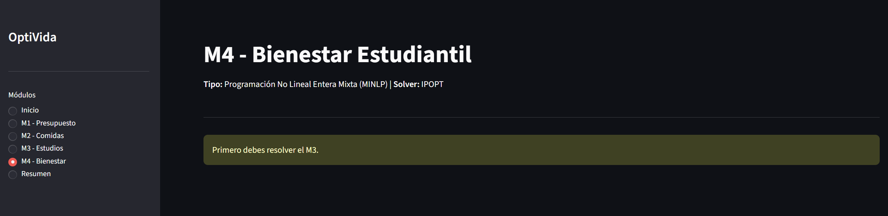